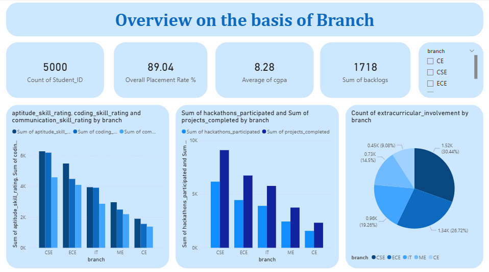
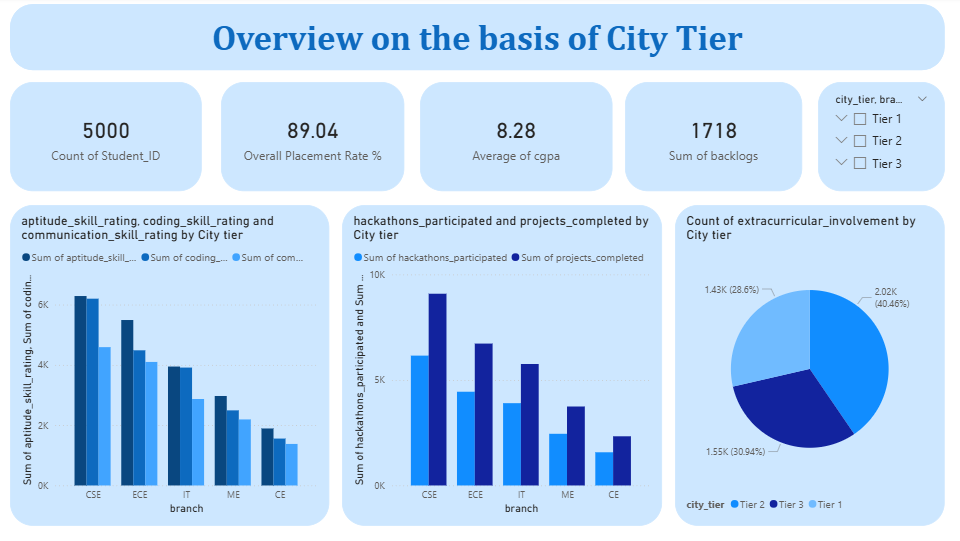
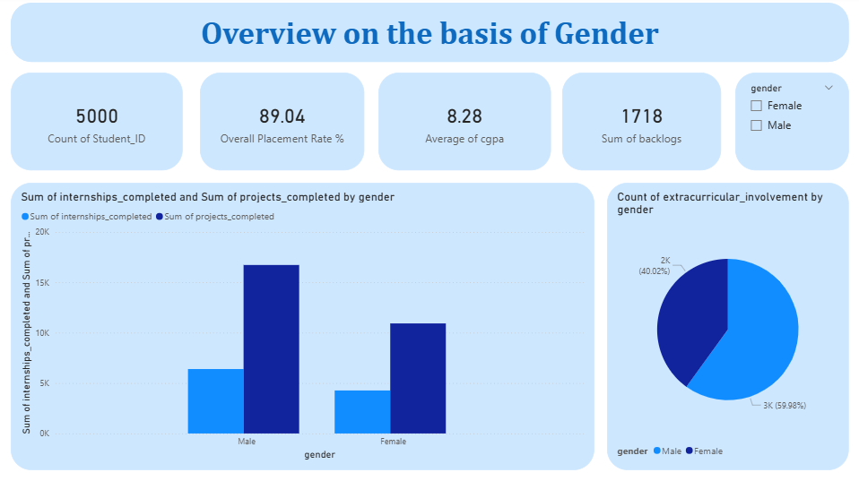

# 🎓 Indian Engineering Student Placement Analysis

## 📌 Project Overview
An interactive **Power BI dashboard** analyzing placement trends of **5,000 Indian engineering students** across branches, city tiers, and gender — uncovering what factors drive successful placements.

---

## 📊 Key Insights
- 📈 **Overall Placement Rate: 89.04%**
- 💻 **CSE dominates** in coding skills, hackathon participation & placements
- 🏙️ **Tier 2 cities** account for 40% of extracurricular involvement
- 👩‍💻 Male students completed more projects, but a **gender gap in internships** exists
- 📉 **ME & CE branches** show significantly lower placement activity

---

## 🛠️ Tools Used
- **Power BI** — Dashboard & Visualizations
- **Excel / CSV** — Data Cleaning & Preparation
- **DAX** — Calculated Measures

---

## 📁 Dashboard Pages
| Page | Description |
|------|-------------|
| Branch Overview | Skills, hackathons & placements by branch |
| City Tier Overview | Placement trends across Tier 1, 2, 3 cities |
| Gender Overview | Internship & project completion by gender |

---

## 📸 Dashboard Preview

---

## 📬 Connect With Me
- 💼 [LinkedIn](https://www.linkedin.com/in/sayedani-shaikh-61a601286)
- 🐙 [GitHub](https://github.com/Sayedani-29)

---

## 📄 License

This project is licensed under the MIT License — see the [LICENSE](./LICENSE) file for details.

